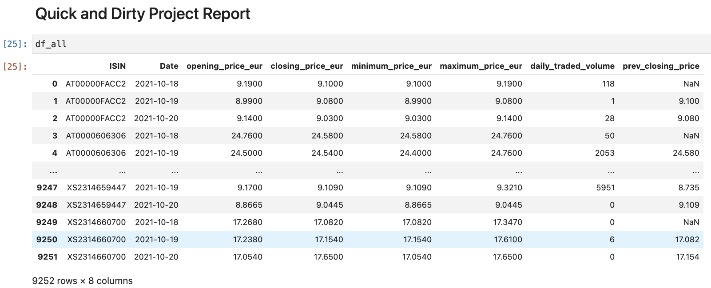

### PLEASE NOTE THE PROJECT IS ONLY 30% COMPLETED.

## My Background

My name is Shaunjay Brown and I have years of experience in Business Intelligence and Data Analysis. Data extraction is one of my many functions and I mainly used SSIS and SQL to Extract Transform and Load. However, I find that SSIS is better suited for large functions like data migration because SSIS has a high overhead cost with maintenance, performance and more importantly time consuming.
I am very excited for my new love for python and using pandas with python allows me to quickly profile the data and quickly decide what I need for my reports. I am going to illustrate a production ready ETL pipeline in python using Pandas tool to write python code and Visual studio to refactorize the code into an object oriented code.

# OOP - "Automate ETL process using Python and AWS"

## Project Background

The Deutsche Börse Public Dataset (PDS) project makes near-time data derived from Deutsche Börse's trading systems available to the public for free. This is the first time that such detailed financial market data has been shared freely and continually from the source provider. This data is provided on a minute-by-minute basis and aggregated from the Xetra and Eurex engines, which comprise a variety of equities, funds and derivative securities. The PDS contains details for on a per security level, detailing trading activity by minute including the high, low, first and last prices within the time period.

 Content 

- Preconfig
  - Set up virtual Environment
  - Set up AWS
- Quick and Dirty Approach - Pandas.

- Functional Approach - Pandas.

- Object Oriented Approach - Visual Studio.

---

 Task Background 

Above is a sample of the data set as an example, the first columnists, the ISIN the
International Securities Identification Number, each entry of an ISIN shows basic information such as the security type and security ID. The StartPrice, MaxPrice, MinPrice EndPrce and shows how many trade volumes and the number of trades.

The case study shows that our client requirements would like to implement a report that is looking like this.

Here we see an aggregation of the ISIN ends on a daily basis and what we want to know are the opening,closing, minimum and maximum price, the daily traded volume and the change of the current day's closing price compared to the previous trading days
Our task now is to create a production ready python data job that is extracting, the source xetra dataset data set from the xetra as S3 buckets since the last run of the job and saves the report in the
target S3 bucket Above This project has four levels of difficulty, with each design increasing in complexity and capability. Each level is critical to the overall project and is recommended to complete all four levels.
--

Preconfig 

#### Set up virtual Environment

    * Virtual Environment -> virtualenv
    * pip
    * setuptools
    * wheel
    * pandas

#### Set up AWS

    * AWS account or register an account for free
    * IAM -> Users -> Add User (create a nane)-> Access type (Programmatic access)
      - Attach existing policies -> Filter police (s3) -> AmazonS3Full Access -> create user
      - Download the CSV file -> Acces Key Id and Secret access key
    * Add Access Key Id and Secret Access key to the environment variables

#### Install AWS CLI

    * open your environment -> (Mac) source ~/.bash_profile or (Windows) pipenv shell
    * mac -> pip3 install awscli windows -> pipenv install awscli
    * Type aws configure and Acces Key Id and Secret access key.. see below

 \* Test connection with the your account and Deutche.. see below

---

 Step one: Quick and Dirty

- **Level One** [`access_xetra_data.ipynb`](Starter-Code/accessing_the_xetra_data.ipynb)
  The goal of this python code is to quickly connect to the project AWS S3 bucket (xetra -proj01) and pull the data file from Deutshce Boerse (deutsche-boerde-extra-pds) AWS S3 bucket.. See Below _blue_ text

  

- **Level Two** - [`quick_xetra_etl.ipynb`](Starter-Code/quick_xetra_etl.ipynb) This illustrate build upon Level One by developing a report that in the future we will automate.. See Below _blue_ text

  

  

---

  

Step two: Reengineer Quick Approach to Funtional Approach 

- This approach allows us to structure our code in small chunks. The functional approach relies on a given input argument and because functions are created in a modular way it lends to a clean and reusable code.

- **Adapter Layer** [`Adapter_Layer.ipynb`](Starter-Code/Adapter_Layer.ipynb)
  This layer has four functions.

  - When the read_csv_to_df function is invoked it reads the csv file(s) and return as a Data Frame.
  - When the write_df_s3 function is invoked it writes Data Frame to the S3 bucket as parquet file.

- **Application Layer**[`Application_Layer.ipynb`](Starter-Code/Application_Layer.ipynb)
  This Layer use the Extract Transform, and Load (ETL) structure

  - When the extract function is invoked it first uses the read_csv_to_df function to read the files and then extract the data and return as an Data Frame
  - When the transform_report1 is invoked it use the Data Frame from the extract function and then Trnsform the data to aggregated columns and then filter by date and return a finish Data Frame (report)

- **Application Layer - not core** [`Application_2.ipynb`](Starter-Code/Application_2.ipynb)]

- **Main Entrypoint Layer** [`Main_Entry.ipynb`](Starter-Code/Main_Entry.ipynb)

---

 Step three: Objection Oriented Programming 

--

 Step four: Finalizing ETL Job 

---

### Requirements

Tools and Package

- Python 3.9
- Jupyter Notebook
- Github
- Visual Studio
- pandas, boto3, pyyaml, awscli, jupyter, pylint, moto, coverage, memory-profile

---

Python Code

- Target format parquet
- First date for the report
- Auto-detection of the source files to be processed
- Configurable production-ready Python job

Best Practice Python

#### Best practices in developing Python code

- Design Princples
- Clean Coding
- Virtual Environments
- Configuration
- Logging
- Folder setup
- Unit Testing
- Exception Handling
- Lintig

© 2021 Trilogy Education Services, a 2U, Inc. brand. All Rights Reserved.
